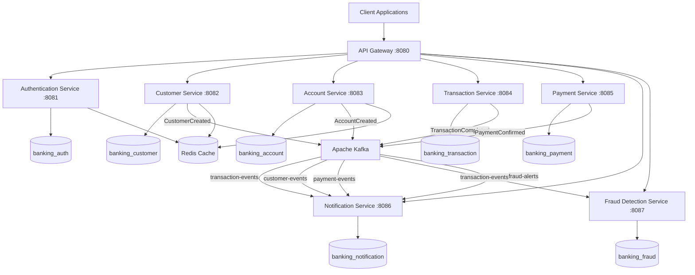
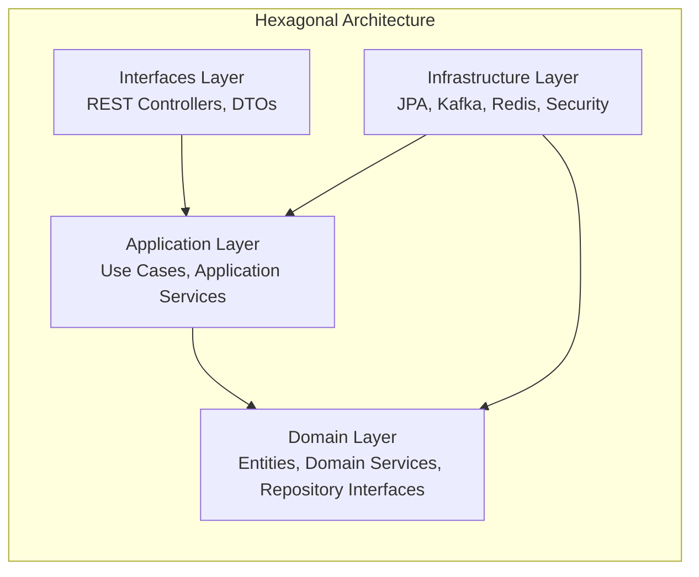
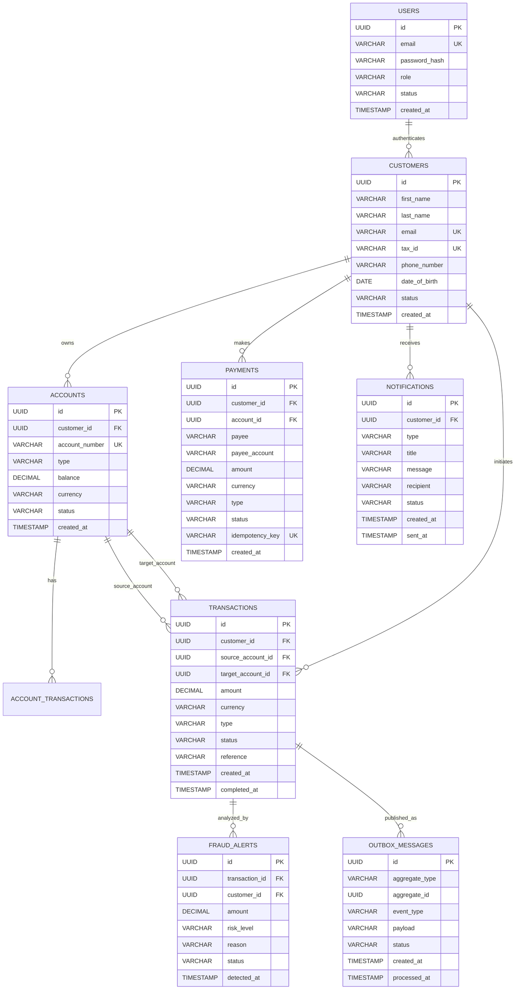
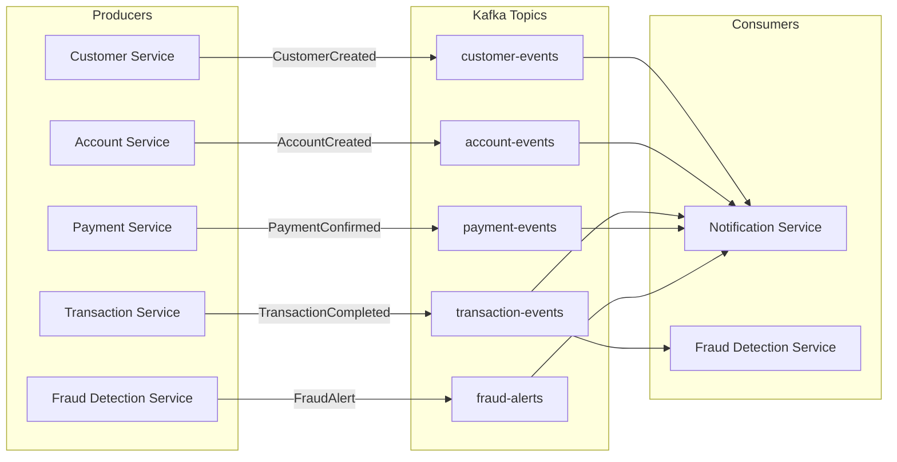
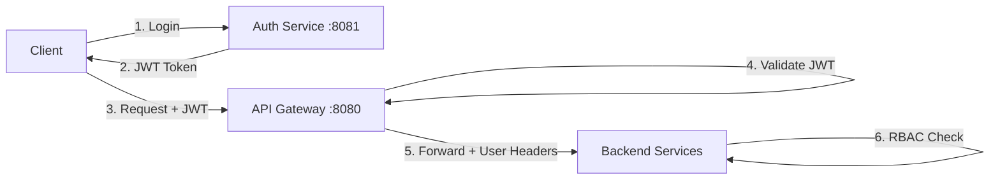
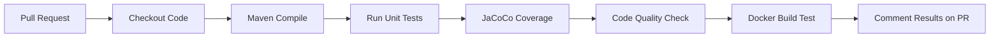
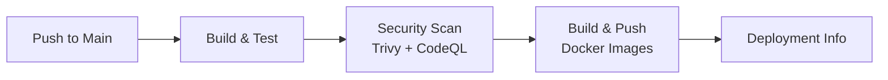

# 🏦 Enterprise Banking Platform

> A production-grade, cloud-native enterprise banking backend platform built with Java 17, Spring Boot 3, microservices architecture, and event-driven design.


---

## 📋 Table of Contents

- [Project Overview](#project-overview)
- [Architecture Overview](#architecture-overview)
- [Technology Stack](#technology-stack)
- [Features](#features)
- [Microservices](#microservices)
- [Database Architecture](#database-architecture)
- [Event-Driven Architecture](#event-driven-architecture)
- [Security Architecture](#security-architecture)
- [Design Patterns](#design-patterns)
- [Running Locally](#running-locally)
- [Running with Docker](#running-with-docker)
- [Running with Kubernetes](#running-with-kubernetes)
- [Running Tests](#running-tests)
- [CI/CD Pipeline](#cicd-pipeline)
- [Observability](#observability)
- [Engineering Decisions](#engineering-decisions)
- [Future Improvements](#future-improvements)
- [Author](#author)

---

## Project Overview

The **Enterprise Banking Platform** is a comprehensive backend system designed to simulate real-world enterprise financial systems. It provides customer management, bank accounts, money transfers, payments, fraud detection, and notifications — all built with enterprise-grade architecture patterns.

### Business Problem Solved

Traditional banking systems are monolithic, difficult to scale, and slow to adapt. This platform demonstrates how a modern, microservices-based architecture can provide:

- **Scalability**: Each service scales independently based on demand
- **Resilience**: Fault isolation prevents cascading failures
- **Auditability**: Complete transaction trails and audit logs
- **Security**: JWT authentication, RBAC, and encrypted password storage
- **Real-time fraud detection**: Event-driven analysis of suspicious transactions

### Engineering Challenges Addressed

1. **Distributed transactions**: Implemented with Saga and Outbox patterns
2. **Event-driven consistency**: Kafka-based communication with idempotency
3. **Idempotent operations**: Duplicate payment detection with unique keys
4. **Circuit breaking**: API Gateway with fault tolerance
5. **Observability**: Prometheus metrics, health checks, and distributed tracing concepts

---

## Architecture Overview

### High-Level Architecture

The platform follows a **microservices architecture** with an **API Gateway pattern** at the front and **event-driven communication** via Apache Kafka between services.



### Hexagonal Architecture (Per Service)

Each microservice follows Clean Architecture / Hexagonal Architecture principles:



---

## Technology Stack

| Category | Technology | Version |
|----------|-----------|---------|
| **Language** | Java | 17 |
| **Framework** | Spring Boot | 3.2.5 |
| **Cloud** | Spring Cloud | 2023.0.1 |
| **Database** | PostgreSQL | 16 |
| **Cache** | Redis | 7 |
| **Migrations** | Flyway | 10.10.0 |
| **Messaging** | Apache Kafka | 3.5 (Confluent) |
| **Security** | JWT (jjwt) + BCrypt | 0.12.5 |
| **API Docs** | SpringDoc OpenAPI (Swagger) | 2.3.0 |
| **Testing** | JUnit 5 + Mockito | 5.10.2 / 5.11.0 |
| **Integration Tests** | Testcontainers | 1.19.7 |
| **Architecture Tests** | ArchUnit | 1.3.0 |
| **Coverage** | JaCoCo | 0.8.11 |
| **Containerization** | Docker | Multi-stage builds |
| **Orchestration** | Kubernetes | 1.28 |
| **Infrastructure** | Terraform | AWS-ready |
| **CI/CD** | GitHub Actions | Two pipelines |
| **Code Quality** | Checkstyle | Plugin |
| **Observability** | Micrometer + Prometheus | Actuator endpoints |

---

## Features

### 🔐 Authentication & Authorization
- JWT-based stateless authentication
- Role-Based Access Control (RBAC): `ADMIN`, `CUSTOMER`, `EMPLOYEE`
- BCrypt password hashing (strength 12)
- Token validation at API Gateway

### 👤 Customer Management
- Customer registration with KYC data
- Customer profile management (update personal data, address)
- Customer status lifecycle: `PENDING_VERIFICATION → ACTIVE → SUSPENDED → CLOSED`
- Tax ID uniqueness validation

### 💳 Account Management
- Multiple account types: `CHECKING`, `SAVINGS`, `BUSINESS`, `JOINT`
- Account status management: `ACTIVE`, `FROZEN`, `CLOSED`
- Balance tracking with transaction history
- Account freeze/close operations with proper validation

### 💸 Transaction Processing
- Money transfers between accounts
- **Saga Pattern** for distributed transactions
- **Outbox Pattern** for reliable event publishing
- **Idempotency** keys to prevent duplicate transactions
- Transaction status tracking: `PENDING → PROCESSING → COMPLETED/FAILED → COMPENSATED`

### 💰 Payment Processing
- Payment types: `BILL_PAYMENT`, `P2P_TRANSFER`, `MERCHANT_PAYMENT`, `INTERNAL_TRANSFER`
- **Idempotency** enforcement via unique keys
- Payment lifecycle: `INITIATED → PROCESSING → CONFIRMED → REFUNDED`
- Event publishing on confirmation

### 🚨 Fraud Detection
- Real-time transaction risk analysis
- Risk levels: `LOW`, `MEDIUM`, `HIGH`, `CRITICAL`
- Detection rules:
  - Amount threshold rules (>$50K = HIGH, >$200K = CRITICAL)
  - Velocity rules (>20 transactions/hour = HIGH)
  - New payee risk detection
  - Unusual hours detection
- Suspicious activity alerts via Kafka

### 📬 Notifications
- Event-driven (Kafka consumers)
- Notification types: `EMAIL`, `SMS`, `PUSH`, `ACCOUNT_ALERT`, `TRANSACTION_ALERT`, `FRAUD_ALERT`
- Consumes events from: transaction, customer, payment, and fraud services
- Notification status tracking: `PENDING → SENT → FAILED`

---

## Microservices

### 1. API Gateway

| Property | Value |
|----------|-------|
| **Port** | 8080 |
| **Responsibility** | Request routing, JWT validation, circuit breaking |
| **Technology** | Spring Cloud Gateway (Reactive/WebFlux) |
| **Dependencies** | Redis, all downstream services |

Routes all client requests to appropriate backend services. Validates JWT tokens and propagates user identity (`X-User-Email`, `X-User-Role`, `X-User-Id`) in headers.

### 2. Authentication Service

| Property | Value |
|----------|-------|
| **Port** | 8081 |
| **Database** | `banking_auth` |
| **Responsibility** | User registration, JWT token generation, authentication |
| **API Path** | `/api/v1/auth/**` |

Endpoints:
- `POST /api/v1/auth/register` — Register new user
- `POST /api/v1/auth/login` — Authenticate and get JWT
- `GET /api/v1/auth/validate` — Validate JWT token

### 3. Customer Service

| Property | Value |
|----------|-------|
| **Port** | 8082 |
| **Database** | `banking_customer` |
| **Responsibility** | Customer profiles, KYC, personal data management |
| **API Path** | `/api/v1/customers/**` |

Endpoints:
- `POST /api/v1/customers` — Create customer
- `GET /api/v1/customers/{id}` — Get customer
- `PUT /api/v1/customers/{id}` — Update customer
- `POST /api/v1/customers/{id}/activate` — Activate customer
- `POST /api/v1/customers/{id}/suspend` — Suspend customer

### 4. Account Service

| Property | Value |
|----------|-------|
| **Port** | 8083 |
| **Database** | `banking_account` |
| **Responsibility** | Bank account creation, balance, status, history |
| **API Path** | `/api/v1/accounts/**` |

Endpoints:
- `POST /api/v1/accounts` — Create account
- `GET /api/v1/accounts/{id}` — Get account
- `GET /api/v1/accounts/number/{accountNumber}` — Get by account number
- `GET /api/v1/accounts/customer/{customerId}` — Get accounts by customer
- `GET /api/v1/accounts/{id}/history?page=0&size=20` — Paginated transaction history
- `POST /api/v1/accounts/{id}/freeze` — Freeze account
- `POST /api/v1/accounts/{id}/close` — Close account

### 5. Transaction Service

| Property | Value |
|----------|-------|
| **Port** | 8084 |
| **Database** | `banking_transaction` |
| **Responsibility** | Money transfers, Saga orchestration, Outbox pattern |
| **API Path** | `/api/v1/transactions/**` |

Endpoints:
- `POST /api/v1/transactions/transfer` — Transfer money
- `GET /api/v1/transactions/{id}` — Get transaction
- `GET /api/v1/transactions/customer/{customerId}` — Transactions by customer
- `GET /api/v1/transactions/account/{accountId}` — Transactions by account

### 6. Payment Service

| Property | Value |
|----------|-------|
| **Port** | 8085 |
| **Database** | `banking_payment` |
| **Responsibility** | Payment processing with idempotency |
| **API Path** | `/api/v1/payments/**` |

Endpoints:
- `POST /api/v1/payments` — Process payment (requires `idempotencyKey`)
- `GET /api/v1/payments/{id}` — Get payment
- `GET /api/v1/payments/customer/{customerId}` — Payments by customer

### 7. Notification Service

| Property | Value |
|----------|-------|
| **Port** | 8086 |
| **Database** | `banking_notification` |
| **Responsibility** | Event-driven notifications (Kafka consumer) |
| **API Path** | `/api/v1/notifications/**` |

Consumes events from:
- `transaction-events` — Transaction alerts
- `customer-events` — Welcome emails
- `payment-events` — Payment confirmations
- `fraud-alerts` — Security alerts

### 8. Fraud Detection Service

| Property | Value |
|----------|-------|
| **Port** | 8087 |
| **Database** | `banking_fraud` |
| **Responsibility** | Real-time transaction risk analysis |
| **API Path** | `/api/v1/fraud/**` |

Endpoints:
- `GET /api/v1/fraud/alerts/customer/{customerId}` — Alerts by customer
- `GET /api/v1/fraud/alerts/open` — All open alerts
- `PUT /api/v1/fraud/alerts/{alertId}/status?status=CONFIRMED_FRAUD` — Update status

---

## Database Architecture

Each microservice has its own database schema. Below is the entity-relationship diagram:



### Database Design Highlights

- **UUID Primary Keys**: Globally unique, no sequential ID leakage
- **Audit Tables**: Track all changes with JSONB diffs
- **Indexes**: Optimized for common query patterns (customer_id, status, email, tax_id)
- **Constraints**: Check constraints for enums, foreign keys, unique constraints
- **Flyway Migrations**: Version-controlled, applied automatically on startup

---

## Event-Driven Architecture

The platform uses Apache Kafka for asynchronous, event-driven communication:



### Event Specifications

| Event | Topic | Key Fields |
|-------|-------|------------|
| `CustomerCreatedEvent` | `customer-events` | `customerId`, `email`, `fullName` |
| `AccountCreatedEvent` | `account-events` | `accountId`, `customerId`, `accountNumber` |
| `TransactionCompletedEvent` | `transaction-events` | `transactionId`, `customerId`, `amount`, `sourceAccountId`, `targetAccountId` |
| `PaymentConfirmedEvent` | `payment-events` | `paymentId`, `customerId`, `amount`, `reference` |
| `FraudAlertEvent` | `fraud-alerts` | `alertId`, `customerId`, `riskLevel`, `reason` |

### Outbox Pattern

The Transaction Service implements the **Outbox Pattern** to ensure atomic event publishing:

1. **Write**: Business data and outbox message are saved in the **same database transaction**
2. **Read**: A process reads pending messages from the outbox table
3. **Publish**: Messages are published to Kafka
4. **Mark**: Successfully published messages are marked as `PROCESSED`
5. **Retry**: Failed messages are retried with incremented retry count

This guarantees that events are never lost, even if Kafka is temporarily unavailable.

---

## Security Architecture



### Authentication Flow

1. **Login**: Client sends credentials to `POST /api/v1/auth/login`
2. **Token Generation**: Auth Service validates credentials and returns a JWT signed with HS256
3. **Request**: Client includes `Authorization: Bearer <jwt>` in all subsequent requests
4. **Gateway Validation**: API Gateway validates JWT and extracts user info
5. **Header Propagation**: Gateway forwards `X-User-Email`, `X-User-Role`, `X-User-Id` headers
6. **Authorization**: Services use `@PreAuthorize` annotations for RBAC

### Roles & Permissions

| Role | Permissions |
|------|-------------|
| `ADMIN` | All operations including account close, customer suspend, fraud alert management |
| `EMPLOYEE` | Account freeze/close, customer activation/suspension, fraud alert management |
| `CUSTOMER` | View own accounts, transactions, initiate transfers and payments |

### Security Measures

- **JWT HS256**: Signed tokens with 256-bit HMAC key
- **BCrypt**: Password hashing with strength 12 (~250ms per hash)
- **Stateless**: No server-side session storage
- **Input Validation**: Jakarta Bean Validation on all endpoints
- **CORS**: Configured per environment
- **Secrets**: Kubernetes Secrets / environment variables (never in code)

---

## Design Patterns

| Pattern | Where Applied | Why |
|---------|--------------|-----|
| **Clean Architecture** | All services | Separation of concerns: domain independent of infrastructure |
| **DDD** | Customer, Account, Transaction | Rich domain models, domain services, repository interfaces |
| **Hexagonal Architecture** | All services | Ports & adapters — domain logic isolated from external concerns |
| **Repository Pattern** | All services | Abstraction over JPA repositories, testable domain logic |
| **DTO Pattern** | All services | Separate API contracts from domain models |
| **Factory Pattern** | Account number generation | Encapsulates creation logic |
| **Saga Pattern** | Transaction Service | Distributed transactions across account services |
| **Outbox Pattern** | Transaction Service | Reliable event publishing without 2PC |
| **Event-Driven** | Notification, Fraud Detection | Decoupled, async communication via Kafka |
| **Idempotency** | Transaction, Payment Services | Duplicate request detection with unique keys |
| **API Gateway** | API Gateway | Single entry point, routing, auth validation |
| **Circuit Breaker** | API Gateway | Fault tolerance for downstream services |
| **CQRS Concepts** | Transaction Service | Separate read/write models for query optimization |
| **Retry Mechanism** | Outbox processor | Exponential backoff for transient failures |

---

## Running Locally

### Prerequisites

| Tool | Version | Required |
|------|---------|----------|
| Java | 17+ | ✅ |
| Maven | 3.8+ | ✅ |
| Docker | 24+ | ✅ |
| Docker Compose | 2.20+ | ✅ |

### Step 1: Clone the Repository

```bash
git clone https://github.com/brunalissa/enterprise-banking-platform.git
cd enterprise-banking-platform
```

### Step 2: Start Infrastructure

```bash
cd docker
docker compose up -d postgres redis zookeeper kafka
```

Wait for services to be healthy:
```bash
docker compose ps
```

### Step 3: Build and Run Services

```bash
# From project root
mvn clean install -DskipTests

# Run each service in a separate terminal
cd services/authentication-service && mvn spring-boot:run
cd services/customer-service && mvn spring-boot:run
cd services/account-service && mvn spring-boot:run
cd services/transaction-service && mvn spring-boot:run
cd services/payment-service && mvn spring-boot:run
cd services/notification-service && mvn spring-boot:run
cd services/fraud-detection-service && mvn spring-boot:run
cd services/api-gateway && mvn spring-boot:run
```

### Step 4: Access the Services

| Service | URL | Swagger UI |
|---------|-----|-----------|
| API Gateway | http://localhost:8080 | http://localhost:8080/swagger-ui.html |
| Authentication | http://localhost:8081 | http://localhost:8081/swagger-ui.html |
| Customer | http://localhost:8082 | http://localhost:8082/swagger-ui.html |
| Account | http://localhost:8083 | http://localhost:8083/swagger-ui.html |
| Transaction | http://localhost:8084 | http://localhost:8084/swagger-ui.html |
| Payment | http://localhost:8085 | http://localhost:8085/swagger-ui.html |
| Notification | http://localhost:8086 | http://localhost:8086/swagger-ui.html |
| Fraud Detection | http://localhost:8087 | http://localhost:8087/swagger-ui.html |

---

## Running with Docker

### One Command to Start Everything

```bash
cd docker
docker compose up -d --build
```

This starts all infrastructure (PostgreSQL, Redis, Kafka) and all 8 microservices.

### Check Service Status

```bash
docker compose ps
docker compose logs -f --tail=100
```

### Stop All Services

```bash
docker compose down

# With data volumes removed
docker compose down -v
```

---

## Running with Kubernetes

### Prerequisites

- kubectl
- A Kubernetes cluster (minikube, kind, or cloud provider)

### Deploy

```bash
# Create namespace and infrastructure
kubectl apply -f infra/kubernetes/namespace.yaml
kubectl apply -f infra/kubernetes/00-configmaps.yaml
kubectl apply -f infra/kubernetes/01-postgres.yaml
kubectl apply -f infra/kubernetes/02-redis.yaml
kubectl apply -f infra/kubernetes/03-kafka.yaml

# Deploy microservices
kubectl apply -f infra/kubernetes/04-api-gateway.yaml
kubectl apply -f infra/kubernetes/05-authentication-service.yaml
kubectl apply -f infra/kubernetes/06-customer-service.yaml
kubectl apply -f infra/kubernetes/07-account-service.yaml
kubectl apply -f infra/kubernetes/08-transaction-service.yaml
kubectl apply -f infra/kubernetes/09-payment-service.yaml
kubectl apply -f infra/kubernetes/10-notification-service.yaml
kubectl apply -f infra/kubernetes/11-fraud-detection-service.yaml

# Deploy Ingress and HPA
kubectl apply -f infra/kubernetes/12-ingress.yaml
kubectl apply -f infra/kubernetes/13-hpa.yaml
```

### Verify

```bash
kubectl get pods -n banking-platform
kubectl get services -n banking-platform
kubectl get ingress -n banking-platform
```

### Port Forward (for testing without Ingress)

```bash
kubectl port-forward svc/api-gateway 8080:8080 -n banking-platform
```

---

## Running Tests

### Run All Tests

```bash
mvn clean test
```

### Run Tests with Coverage Report

```bash
mvn clean verify
```

Coverage reports are generated at `services/<service-name>/target/site/jacoco/index.html`.

### Run Unit Tests Only

```bash
mvn test -pl services/authentication-service
```

### Run Integration Tests

```bash
mvn failsafe:integration-test failsafe:verify
```

### Run Architecture Tests

```bash
mvn test -Dtest=ArchitectureTest
```

### Test Categories

| Type | Framework | Location | Purpose |
|------|-----------|----------|---------|
| Unit Tests | JUnit 5 + Mockito | `src/test/java/.../unit/` | Test domain services, business rules |
| Integration Tests | Testcontainers | `src/test/java/.../integration/` | Test repository, Kafka, API endpoints |
| Architecture Tests | ArchUnit | `src/test/java/.../architecture/` | Enforce layer dependencies |

---

## CI/CD Pipeline

### Pull Request Pipeline (`.github/workflows/pr-pipeline.yml`)



Triggers on: `pull_request` to `main` or `develop`

### Main Branch Pipeline (`.github/workflows/main-pipeline.yml`)



Triggers on: `push` to `main`

Jobs:
1. **build-test**: Maven clean verify + JaCoCo coverage
2. **security-scan**: Trivy vulnerability scan + CodeQL static analysis
3. **docker-build-push**: Build and push all service images to GHCR
4. **deploy-info**: Print deployment instructions

---

## Observability

### Health Checks

Each service exposes Spring Boot Actuator health endpoints:
```
GET /actuator/health
```

### Prometheus Metrics

Each service exposes Prometheus metrics:
```
GET /actuator/prometheus
```

Metrics include:
- `http_server_requests_seconds` — HTTP request latency
- `jvm_memory_used_bytes` — JVM memory usage
- `process_cpu_usage` — CPU usage
- `kafka_consumer_records_consumed_total` — Kafka consumer throughput
- `hikari_pool_connections_active` — Database connection pool

### Logging Strategy

- **Format**: JSON structured logging (production)
- **Levels**: ERROR (prod), WARN (staging), DEBUG (dev)
- **Correlation IDs**: Each request has a unique trace ID propagated via headers
- **Log Aggregation**: Ready for ELK/EFK stack integration

### Distributed Tracing

The architecture is designed for distributed tracing:
- API Gateway injects `X-Request-Id` and `X-Trace-Id` headers
- Each service propagates trace headers
- Ready for OpenTelemetry / Jaeger integration

---

## Engineering Decisions

Architecture Decision Records (ADRs) document key technical decisions:

| ADR | Title | Decision |
|-----|-------|----------|
| [ADR-001](docs/adr/ADR-001-microservices-architecture.md) | Microservices Architecture | 8 independent services, each with own DB |
| [ADR-002](docs/adr/ADR-002-kafka-event-communication.md) | Kafka Event Communication | Apache Kafka with Outbox Pattern |
| [ADR-003](docs/adr/ADR-003-postgresql-database-choice.md) | PostgreSQL Database Choice | PostgreSQL 16 with Flyway migrations |

---

## Future Improvements

| Area | Improvement | Priority |
|------|-------------|----------|
| **Scalability** | Kubernetes HPA with custom metrics (Kafka lag) | High |
| **Deployment** | GitOps with ArgoCD for automated Kubernetes deploys | High |
| **Observability** | OpenTelemetry + Jaeger for distributed tracing | High |
| **Security** | OAuth2 with Keycloak integration | Medium |
| **Fraud Detection** | ML-based anomaly detection with TensorFlow | Medium |
| **Multi-Region** | Active-active multi-region deployment | Medium |
| **Event Sourcing** | Full CQRS + Event Sourcing for audit trail | Medium |
| **API** | GraphQL gateway for client-specific queries | Low |
| **Caching** | Redis read-through cache for account balances | Low |
| **Testing** | Contract testing with Spring Cloud Contract | Low |

---

## Author

### Bruna Lissa de Almeida

**Role**: DevOps / Cloud / Platform / DevSecOps Engineer

- 📧 Email: [brubsalmeida0@gmail.com](mailto:brubsalmeida0@gmail.com)
- 🐙 GitHub: [@brunalissa](https://github.com/brunalissa)
- 💼 LinkedIn: [Bruna Lissa de Almeida](https://www.linkedin.com/in/brunalissa)

---

## License

This project is licensed under the MIT License — see the [LICENSE](LICENSE) file for details.

---

## Acknowledgments

- [Spring Boot](https://spring.io/projects/spring-boot) — Application framework
- [Apache Kafka](https://kafka.apache.org/) — Event streaming platform
- [PostgreSQL](https://www.postgresql.org/) — Relational database
- [Testcontainers](https://www.testcontainers.org/) — Integration testing
- [ArchUnit](https://www.archunit.org/) — Architecture tests

---

> Built with ❤️ as a portfolio project demonstrating enterprise backend engineering, distributed systems, and cloud-native architecture.